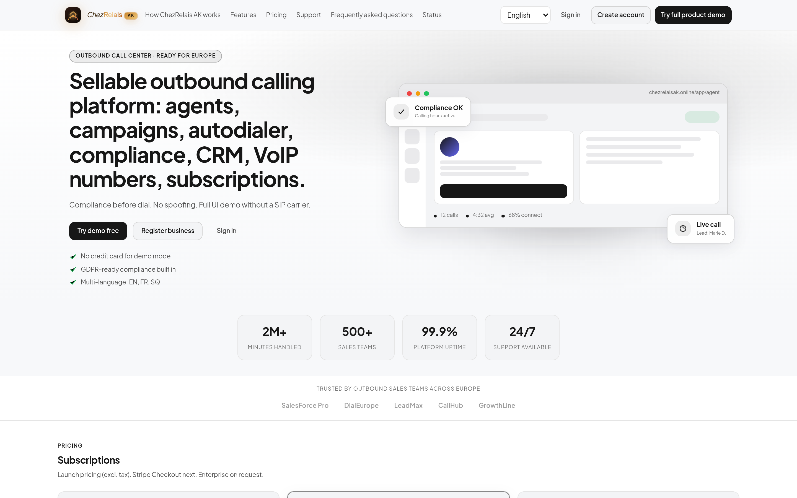
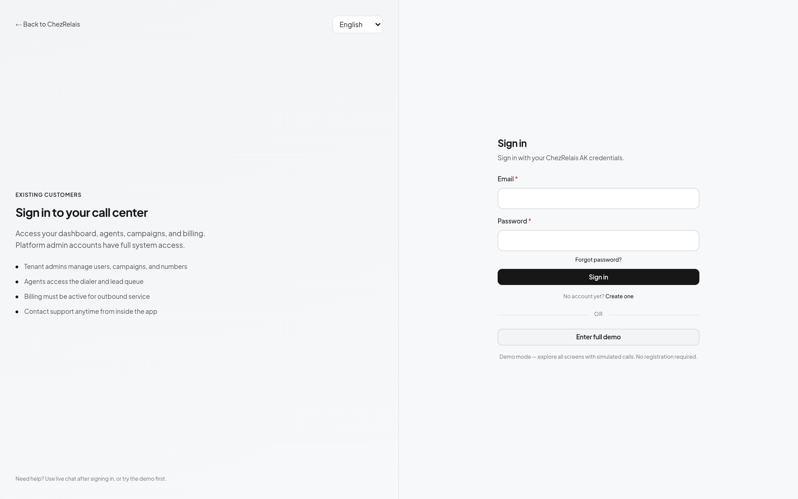
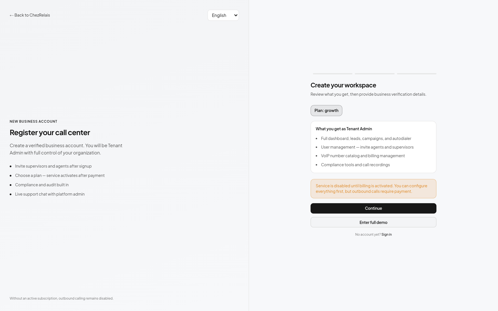
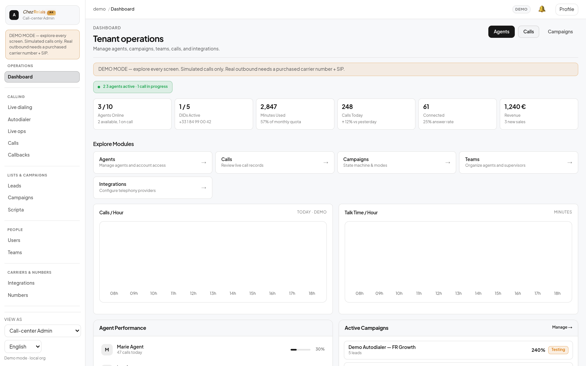
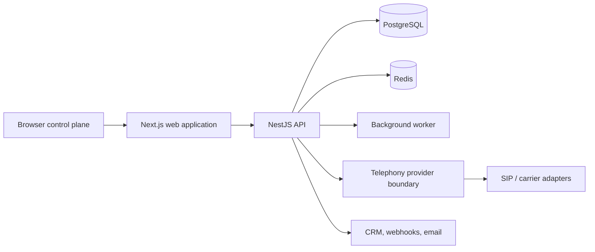

# AtlasCall

**A compliance-first outbound sales call-center platform** — agent desktop, campaign control, autodialer, CRM and telephony-provider isolation in one browser-based control plane.

> **This repository is a portfolio case study, not a source mirror.** The production implementation is private and proprietary. See [Ownership](#ownership).

---

## Live Demo

### ▶ [https://www.chezrelaisak.online](https://www.chezrelaisak.online)

No carrier, credit card or signup required. Choose **Try full product demo** to enter a populated workspace with agents, campaigns, an autodialer queue, call history and live compliance state.

---

## Screenshots

| Marketing site | Sign in |
| :---: | :---: |
|  |  |

| Registration and plans | Agent operations workspace |
| :---: | :---: |
|  |  |

---

## Overview

AtlasCall is a browser-based control plane for outbound sales teams. It brings leads, campaigns, agent workspaces, compliance gates, callbacks, recording metadata, reporting, billing foundations and operational diagnostics into a single system.

The product is operated publicly under the **ChezRelais AK** brand.

The system is designed around one strict rule:

> If consent, suppression, calling hours, compliance data or telephony health cannot be verified, **the call is blocked**.

That rule is enforced in the dial path itself rather than in a UI layer, so an unknown or unverifiable state fails closed instead of silently dialing.

---

## Features

**Operations**
- Agent desktop with live call controls and disposition workflow
- Supervisor and tenant-admin views over the same data model
- Campaign state machine with dialer modes
- Autodialer queue with pacing and channel-limit awareness
- Callbacks, call history and recording metadata

**Data and workflow**
- Lead import and validation, including CSV handling
- CRM-oriented workflows and lead lifecycle
- Scripts and call guidance
- Reporting and operational diagnostics

**Platform**
- Role-based access control with tenant-scoped data access
- Consent and suppression handling
- Number inventory and caller-ID management
- Billing and subscription foundations
- Multi-language UI foundations (English, French, Albanian)
- Health endpoints, setup diagnostics and structured API errors

---

## Technology

| Layer | Stack |
| :--- | :--- |
| **Web** | Next.js, React, TypeScript |
| **API** | NestJS with the Fastify adapter |
| **Data** | PostgreSQL with Prisma |
| **Cache / queues** | Redis-compatible infrastructure |
| **Jobs** | Dedicated Node.js worker process |
| **Auth** | Session and JWT-based access with role scoping |
| **Telephony** | Provider abstraction — simulated, SIP and carrier adapters |
| **Testing** | Vitest and Playwright |
| **CI** | GitHub Actions (typecheck, tests, build, environment doctor) |
| **Delivery** | Vercel for the web application, Render for the API and PostgreSQL |

---

## Architecture

The deployment is a modular monolith with a separate worker and an isolated telephony boundary:

- **Web** renders the operator and agent experience and talks only to the API.
- **API** owns business rules, authorization and the dial decision.
- **Worker** runs background and maintenance jobs outside the request path.
- **Telephony** sits behind a provider interface, so carrier-specific behaviour never leaks into application logic.

A deliberate design constraint is that carrier complexity — SIP signalling, media handling, provider quirks — is hidden from the operator. Agents see calls, not infrastructure.

---

## Technical Highlights

**Fail-closed compliance.** Outbound eligibility is evaluated before a call is placed. Missing consent, suppression hits, out-of-hours attempts and unverifiable compliance state all resolve to *do not dial*.

**Provider isolation.** A single `TelephonyProvider` contract covers simulated calling, SIP-based carriers and future integrations. Swapping carriers does not require changes to campaign, queue or agent logic.

**Honest demo mode.** The public demo runs fully simulated telephony and is explicitly labelled as such in the interface. The system does not present simulated calls as real ones, and the boundary between demo and live behaviour is enforced rather than cosmetic.

**Server-side authorization.** Role and organization scoping are enforced in the API, not in the client. The UI reflects permissions; it does not grant them.

**Structured failure behaviour.** Unavailable dependencies and rejected operations return structured, typed errors instead of ambiguous failures, which keeps the agent UI deterministic when a downstream service is degraded.

**Monorepo with shared contracts.** Shared packages carry types, configuration validation, compliance rules, RBAC and telephony contracts across the web app, API and worker, so a contract change is a compile-time error rather than a runtime surprise.

---

## Engineering Challenges

- **Keeping compliance truthful.** It is easy to build a dialer that dials. It is considerably harder to build one that refuses to dial when the legal or consent basis is unclear — and to make that refusal visible and explainable to the operator.
- **Isolating telephony.** Carrier integrations arrive with inconsistent semantics. Containing them behind one contract took deliberate boundary work.
- **Separating demo from production honestly.** The demo must be genuinely useful without implying that live carrier calling is configured when it is not.
- **Multi-tenant correctness.** Organization scoping has to hold across every query, not just the obvious ones.
- **Deploying a monorepo to split hosting.** The web application and the API have different runtime requirements, so the build has to be selective without losing shared-package contracts.

---

## Deployment

The production arrangement is split by runtime requirement:

| Component | Host |
| :--- | :--- |
| Web application | Vercel |
| API service | Render |
| Database | Render PostgreSQL |
| Worker | Separate process when background processing is enabled |

Web and API are deployed independently and communicate over HTTPS, which means the frontend can be released without redeploying the API and vice versa.

No credentials, environment files or private deployment configuration are stored in this repository.

---

## Project Status

**Active development.** The public demo is available for product and interface review.

Real carrier calling and browser media are external production dependencies. They are intentionally not represented as complete when they are not configured — the interface states the current capability rather than implying more than it can deliver.

---

## Ownership

Built by **Flamur** ([@ulasmango-cmd](https://github.com/ulasmango-cmd)).

- GitHub profile: [github.com/ulasmango-cmd](https://github.com/ulasmango-cmd)
- Live demo: [chezrelaisak.online](https://www.chezrelaisak.online)
- Private production source: [ulasmango-cmd/atlascall](https://github.com/ulasmango-cmd/atlascall) *(private)*

---

## License

The production implementation is **private and proprietary**. This repository contains portfolio documentation and product screenshots only — it intentionally does not include application source code, business logic, infrastructure configuration or credentials.

© Flamur. All rights reserved.
