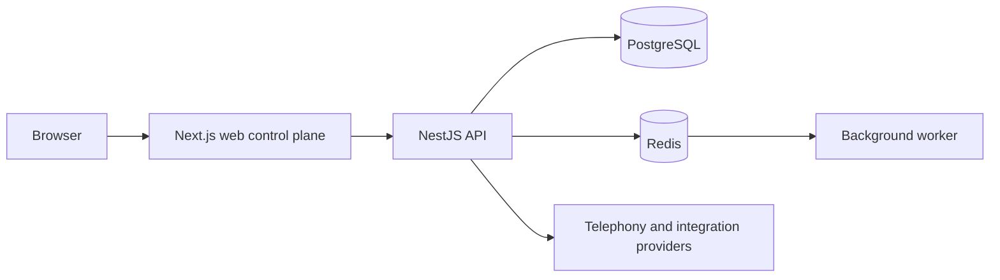

# AtlasCall

> A compliance-first outbound sales call-center platform with agent operations, campaign control, CRM workflows, and telephony provider isolation.

## Live Demo

[Open the AtlasCall demo](https://www.chezrelaisak.online)

The demo uses honest simulated telephony until a production carrier and media bridge are configured.

## Overview

AtlasCall is a browser-based control plane for outbound sales teams. It brings leads, campaigns, agent workspaces, compliance gates, callbacks, recordings metadata, reporting, billing foundations, and operational diagnostics into one system.

The product is designed around a strict rule: if consent, suppression, calling hours, compliance data, or telephony health cannot be verified, the call is blocked.

## Highlights

- Agent desktop and supervisor operations views
- Lead, campaign, callback, sales, and reporting workflows
- Consent-first outbound eligibility for France-focused deployments
- Role-based access control and tenant-scoped data access
- Mock, SIP, and future carrier integrations behind a provider boundary
- Background jobs for retention and operational maintenance
- English, French, and Albanian UI foundations
- Health endpoints, setup diagnostics, and structured API errors

## Technology

- **Web:** Next.js, React, TypeScript
- **API:** NestJS with Fastify
- **Data:** PostgreSQL with Prisma
- **Jobs:** Node.js worker process
- **Cache and queues:** Redis-compatible infrastructure
- **Testing:** Vitest and Playwright
- **Deployment direction:** Vercel for the web application, Render for the API and supporting services

## Architecture

The production implementation is maintained separately in a private source repository. This public repository is a portfolio and case-study presentation, not a source-code mirror.

## Engineering Focus

- Fail-closed outbound compliance checks
- Explicit separation between demo behavior and live provider behavior
- Server-side authorization and organization scoping
- Structured failure responses for unavailable dependencies
- Provider interfaces that keep carrier-specific behavior isolated
- Durable maintenance workflows for recordings and dialer operations

## Verification

The current private source repository has verified:

- Production build across packages, web, API, and worker
- TypeScript typecheck across the workspace
- Workspace unit tests passing
- JSON deployment configuration validation
- Secret-pattern scan with no token-shaped values in the working tree

## Project Status

Active development. The public demo is available for product and interface review. Real carrier calling and browser media are external production dependencies and are intentionally not represented as complete when they are not configured.

## Deployment

The intended deployment split is:

- **Web:** Vercel-compatible Next.js deployment
- **API:** Render-compatible Node service
- **Database:** Managed PostgreSQL
- **Worker:** Separate Node worker process when background processing is enabled

No credentials or private deployment configuration are stored in this repository.

## Ownership

Built by [ulasmango-cmd](https://github.com/ulasmango-cmd).

- Private production source: [ulasmango-cmd/atlascall](https://github.com/ulasmango-cmd/atlascall)
- Live demo: [chezrelaisak.online](https://www.chezrelaisak.online)

## License

The production implementation is private and proprietary. This repository contains portfolio documentation only.
